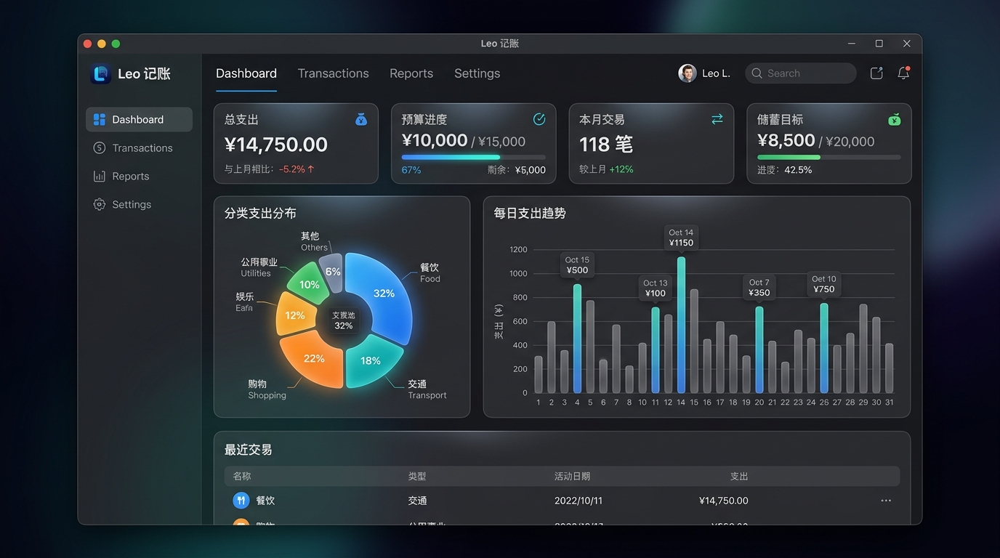

# 💰 Leo记账 (Leo Ledger)

> **一个简单、好用、本地优先的个人记账桌面 App**  
> 记录每一笔花销，清晰掌握每一分钱的去向。数据全量保存在本地电脑，零上传，隐私 100% 安全。


---

## 🖼️ 应用界面预览 (Preview)



---

## ✨ 核心亮点 (Key Features)

- 🔒 **本地优先与隐私保密**: 所有账单数据均保存在本地 SQLite 数据库中，无需注册网络账号，不依赖第三方云端，离线完全可用。
- 🎨 **高颜值现代 UI 界面**: 支持 ☀️ **浅色模式** / 🌙 **深色模式** 一键切换，具备全套玻璃拟态卡片与精心调配的色彩系统。
- ⚡ **快捷记账与填单预设**: 内置常用消费快捷标签（*早餐*、*午餐*、*打车*、*外卖*、*咖啡* 等），一键快速记账；支持输入金额、二级分类、日期与备注。
- ⚙️ **月度预算与警示**: 可自由设定每月开支上限，实时计算预算已用百分比与剩余额度（具备 75% 预警与 90% 超支提醒）。
- 📊 **多维图表与数据看板**:
  - **KPI 统计看板**: 本月总支出、日均开销、最高单笔开销、记账总笔数。
  - **大类占比饼图**: 直观呈现 10 大一级分类的支出结构。
  - **趋势柱状图**: 支持 **按日** / **按周** / **按月对比** 自由切换。
  - **细分小类排行**: 横向条形图展现 52 个二级分类的花销排行。
- 📥 **数据备份与导出**: 支持一键将账单导出为 `.csv` 标准表格文件，方便在 Excel 中二次分析或备份。

---

## 🛠️ 技术选型 (Tech Stack)

| 模块 | 技术栈 / 工具 | 说明 |
| --- | --- | --- |
| **界面 UI** | React 18 + TypeScript | 声明式界面与类型安全开发 |
| **构建工具** | electron-vite + Vite 7 | 极速的热更新与高效打包 |
| **桌面外壳** | Electron 33 | 跨平台 Windows & Mac 桌面支持 |
| **本地数据库**| SQLite (`sql.js`) | 纯 WebAssembly 驱动，无 C++ 编译依赖 |
| **数据可视化**| Recharts 3 | 基于 React 的交互式图表库 |

---

## 📂 项目目录结构 (Directory Structure)

```text
leo/
├─ CLAUDE.md              # 项目产品与技术设计规范总纲
├─ README.md              # 项目介绍文档
└─ leo-app/               # 桌面端主工程
   ├─ electron/           # 主进程与本地数据访问层 (Node/Electron)
   │  ├─ main.ts          # Electron 入口、窗口创建与 IPC 监听
   │  ├─ preload.ts       # Bridge 隔离脚本
   │  └─ db.ts            # SQLite 数据访问层 (sql.js)
   ├─ src/                # 渲染进程 UI (React)
   │  ├─ App.tsx          # 记账 App 主界面逻辑
   │  ├─ App.css          # 全套现代化组件样式
   │  └─ index.css        # 全局设计系统与主题 Variables
   └─ package.json        # 依赖与脚本定义
```

---

## 🚀 快速开始 (Quick Start)

### 1. 克隆项目
```bash
git clone https://github.com/yanglei070-ux/yanglei070-ux.github.io.git
cd yanglei070-ux.github.io/leo-app
```

### 2. 安装依赖
```bash
npm install
```

### 3. 开发模式启动
```bash
npm run dev
```

---

## 📦 打包与分发 (Build & Package)

### 本地构建产物
```bash
npm run build
```

### 一键打出 Windows 安装包 (.exe)
```bash
npm run dist
```
*构建产物将保存在 `leo-app/release/` 目录下，包含 `leo-0.0.0-setup.exe` 安装文件及免安装绿化版。*

---

## 📄 开源协议 (License)

本项目采用 [MIT License](LICENSE) 协议开源。
